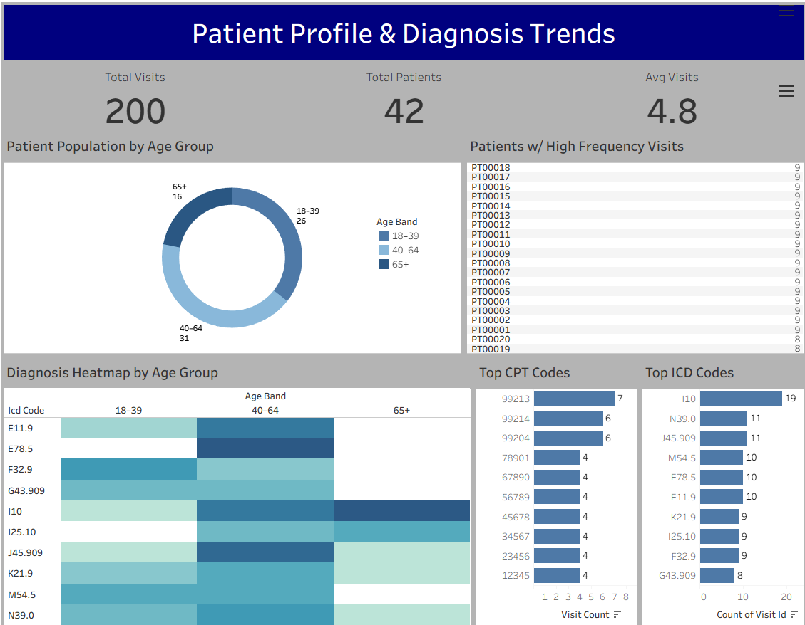

# Healthcare Patient Analytics Dashboard

Interactive Tableau dashboard analyzing:
- Patient demographics
- Diagnosis trends
- Visit utilization
- CPT procedure frequency

## Tools Used
- Tableau
- Excel
- SQL concepts

## Dashboard Features
- KPI summary cards
- Donut chart visualization
- Diagnosis heatmap
- CPT/ICD ranking charts
- High-utilizer patient analysis

## Key Insights
- Majority of patients fall within the 40–64 age group
- Several ICD diagnoses dominate across multiple age groups
- Average patient visit frequency is 4.8 visits
- Certain CPT procedures are consistently performed most frequently

## Dashboard Preview

